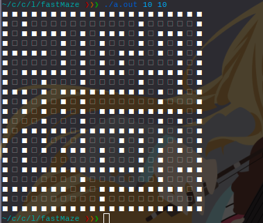

# fastMaze
fastMaze - is my implementation maze generation algorithm..
It is not needed dependencies except standrat c++ libruary.

## For build it just execute below in your shell:

```sh
g++ maze.cpp -o mazegen -O3
```

## Usage:

```
./mazegen <width> <height>
```
## Example:

